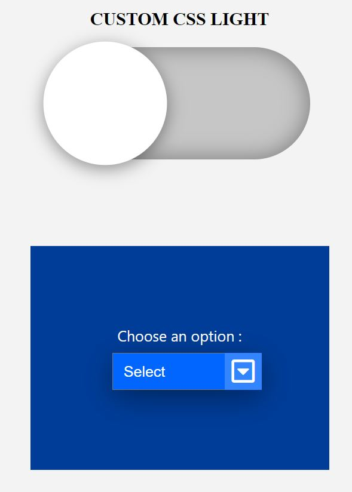

# Toggle-and-Select-

This is a design of the Toggle and select Button.

## Table of contents

- [Overview](#overview)
  - [The challenge](#the-challenge)
  - [Screenshot](#screenshot)
  - [Links](#links)
- [My process](#my-process)
  - [Built with](#built-with)
  - [What I learned](#what-i-learned)
- [Author](#author)

## Overview

### The challenge

Users should be able to:

- View the optimal animation on clicking on the button.

### Screenshot

- Normal View - Clicking View

### Links

- Solution URL: [Github](https://github.com/zaidansari42/Toggle-and-Select-Button-/)
- Live Site URL: [Live Website](https://zaidansari42.github.io/Toggle-and-Select-Button-/)

## My process

### Built with

- Semantic HTML5 markup
- CSS custom properties
- Flexbox

### What I learned

I learned how to create a beautiful card with only HTML & CSS.

```html
<i class="fa-solid fa-square-chevron-down"></i>
```

```css
input[type="checkbox"]:before {
  content: "";

  position: absolute;
  height: 150px;
  width: 150px;

  background-color: #fff;
  border-radius: 50%;
  box-shadow: 0 5px 20px rgba(0, 0, 0, 0.4);

  transform: scale(1.1);
  transition: 0.5s ease-in-out;
}
```

## Author

- Website - [Zaid Ansari](https://github.com/zaidansari42/)
- Twitter - [@zaidnasari42](https://www.twitter.com/zaidnasari42)
